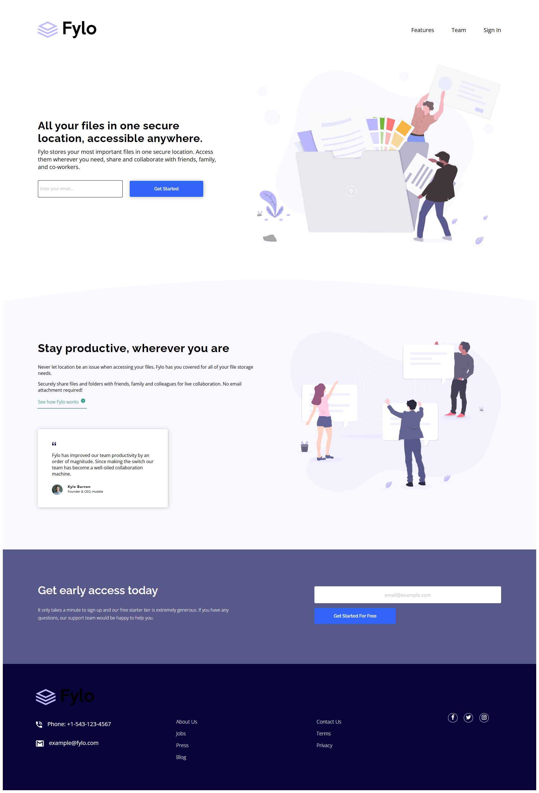

# Frontend Mentor - Fylo landing page with two column layout solution

This is a solution to the [Fylo landing page with two column layout challenge on Frontend Mentor](https://www.frontendmentor.io/challenges/fylo-landing-page-with-two-column-layout-5ca5ef041e82137ec91a50f5). Frontend Mentor challenges help you improve your coding skills by building realistic projects. 

### Links

- Solution URL: [Add solution URL here](https://github.com/samuel-faith/3-column-preview-card-component-main)
- Live Site URL: [Add live site URL here](https://samuel-faith.github.io/3-column-preview-card-component-main/)

## My process

### Built with

- Semantic HTML5 markup
- CSS custom properties
- Flexbox
- Mobile-first workflow

### What I learned

Use of CSS propoerties to position components on web pages, and make them mobile responsive.